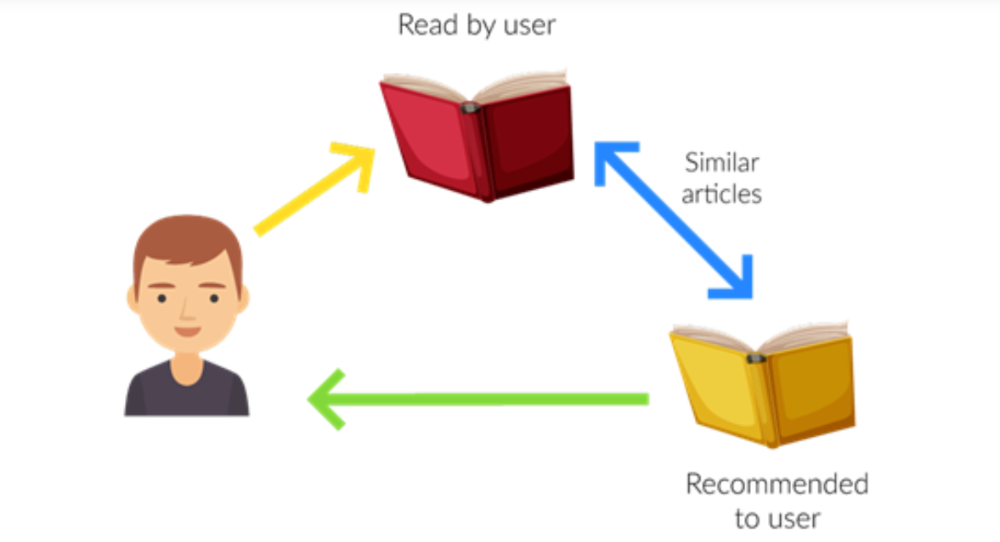

<!--  -->
<!--  -->

<p align="center" width="100%">
    
</p>

# FairBook
The recent study of Abdollahpouri et al. [1] in the domain of movie recommendation shows that the popularity bias causes unfair recommendations in respect to both the providers of less popular items and users with little interest in popular items. In this paper, we extend and reproduce the study of Abdollahpouri et al. [1] in the domain of book recommendation.

## Dataset
In this study, we use <a href=http://www2.informatik.uni-freiburg.de/~cziegler/BX/>`Book-Crossing`</a> dataset to evalue the performance and fairness of the models. The dataset and user groups are accessible in the <a href='dataset/Bookcrossing'>`dataset`</a> folder. The foder contains the following files:

- **<a href='dataset/Bookcrossing/user-group'>`user-group`</a> folder**: `active_users.txt`, `inactive_users.txt`, `medium_users.txt` which are related to `Niche`, `Diverse`, and `BestSeller` user groups, respectively.
- **BX-Book-Ratings.csv**: The original `Book-Crossing` dataset which contains `User-ID`, `ISBN`, and `Book-Rating`.
- **BX-Book-Explicit-5Rate-Map.csv**: The explicit 5-core book-crossing dataset in which the uesr and item IDs are mapped into new IDs. (*CSV format*).
- **BX-Book-Explicit-5Rate-Map.txt**: The explicit 5-core book-crossing dataset in which the uesr and item IDs are mapped into new IDs. (*TXT format*).

### BookCrossing
The statistics of the datasets after preprocessing are as follows: 

- Number of users: 6,358 
- Number of items: 6,921
- Number of interactions: 88,552
- User per groups: `{Niche: 1271, Diverse: 3816, BestSeller: 1271}`,
- User Profile size per group: `{Niche: 14006, Diverse: 61889, BestSeller: 12657}`

## Codes
We provide the <a href=https://colab.research.google.com/github/rahmanidashti/FairBook/blob/main/FairBook.ipynb>`FairBook.ipynb`</a> to run the code and the model for the analysis and recommendation performacne. 

## Reference
```
@inproceedings{naghiaei2022fairbook,
title = {The Unfairness of Popularity Bias in Book Recommendation},
author={Naghiaei, Mohammadmehdi and Rahmani, Hossein A. and Dehghan, Mahdi},
booktitle = {Third International Workshop on Algorithmic Bias in Search and Recommendation (Bias@ECIR 2022)},
year = {2022},
url = {https://arxiv.org/abs/XXX},
}
```

## Team
<a href=#>Mohammadmehdi Naghiaei</a>, University of Southern California

<a href=#>Hossein A. Rahmani</a>, Wen Intelligence Group, UCL

<a href=#>Mahdi Dehghan</a>, Shahid Beheshti University

## Acknowledgements
TBA

## Contact
If you have any questions, do not hesitate to contact us by h.rahmani@ucl.ac.uk or rahmanidashti@gmail.com, we will be happy to assist.
